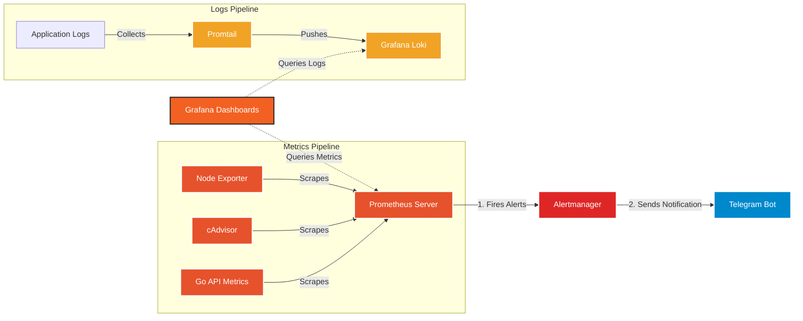

# Monitoring Stack with Prometheus, Grafana, Loki & Alertmanager

## Overview

Hi, I'm Artem (whosthefunky).
This project is a hands-on monitoring and observability stack built with Docker Compose.
The goal of the project was to practice real-world monitoring, logging, alerting, and infrastructure troubleshooting workflows commonly used in DevOps and Cloud environments.

The stack includes:

* Metrics collection with Prometheus
* Visualization with Grafana
* Container monitoring with cAdvisor
* Host monitoring with Node Exporter
* Centralized logging with Loki + Promtail
* Alerting with Alertmanager
* Telegram alert notifications
* A small Go API application generating logs and metrics traffic

---

# Tech Stack

* Docker & Docker Compose
* Prometheus
* Grafana
* Loki
* Promtail
* Alertmanager
* Node Exporter
* cAdvisor
* Golang

---

# Architecture

Metrics flow:

Node Exporter / cAdvisor / Go API
→ Prometheus
→ Grafana dashboards
→ Alertmanager
→ Telegram notifications

Logs flow:

Docker logs
→ Promtail
→ Loki
→ Grafana Explore

---

# Dashboards

The project contains two dashboards:

## 1. Infrastructure Dashboard

Includes:

* CPU usage
* Memory usage
* Disk usage
* Network activity
* Host metrics
* Application logs panel
* Alert list


---

## 2. Containers Dashboard

Includes:

* Container CPU usage
* Container memory usage
* Network traffic
* Docker container monitoring with cAdvisor


---

# Logging

Logs are collected from Docker containers using Promtail and stored in Loki.

Grafana Explore is used for:

* searching logs
* filtering by containers
* troubleshooting application issues

Example log query:

```logql
{compose_service="go-api"} |= "GET"
```


---

# Alerting

Alertmanager is configured with Telegram notifications.

Implemented alerts:

* ServiceDown
* HighCPU
* HighMemory
* ContainerHighMemory

Example:

* stopping a container triggers a Prometheus alert
* Alertmanager sends a Telegram notification


---

# How to Run


```bash
docker compose up -d
```

Grafana:
http://localhost:3000

Prometheus:
http://localhost:9090

Alertmanager:
http://localhost:9093

---


